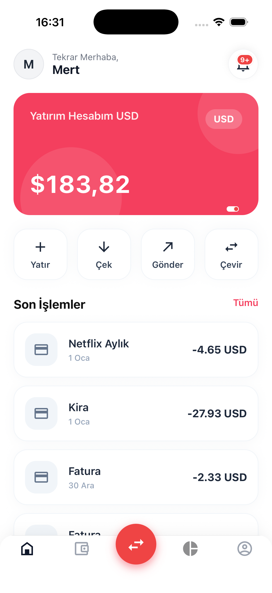
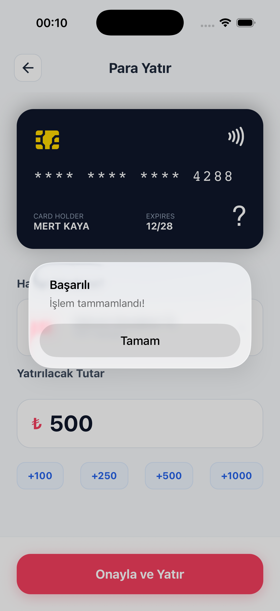
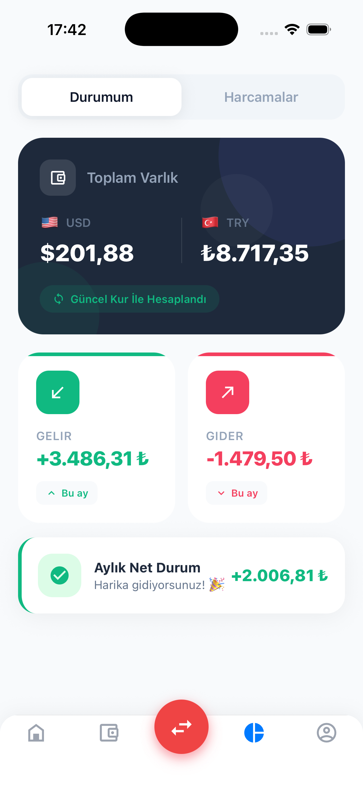

# Digital Wallet

A full-featured digital wallet application built with a reactive architecture. The backend runs on Spring Boot WebFlux with event-driven transaction processing via Kafka; the frontend is a React Native mobile application.

---

## Screenshots

<table align="center" border="0" cellspacing="10" cellpadding="10">
  <tr>
    <td align="center"></td>
    <td align="center"></td>
    <td align="center"></td>
  </tr>
  <tr>
    <td align="center"><em>Home</em></td>
    <td align="center"><em>Deposit</em></td>
    <td align="center"><em>Analytics</em></td>
  </tr>
</table>

---

## Features

- JWT authentication with refresh token rotation
- Multi-currency wallets (TRY, USD, EUR, etc.)
- Event-driven transactions via Outbox Pattern + Kafka
- Real-time exchange rate sync (Frankfurter API)
- Email and phone verification via OTP
- Monthly spending analytics
- IP-based rate limiting on auth endpoints
- Token blacklisting on logout (Redis)
- National ID (TCKN) encryption (AES-256)
- Account lockout after repeated failed login attempts

---

## Architecture

```
┌─────────────────────────────────────────────────────────────┐
│                     React Native App                        │
└───────────────────────────┬─────────────────────────────────┘
                            │ HTTPS / REST
┌───────────────────────────▼─────────────────────────────────┐
│                Spring Boot WebFlux (Reactive)                │
│                                                             │
│  ┌──────────┐  ┌──────────┐  ┌──────────┐  ┌────────────┐  │
│  │   Auth   │  │  Wallet  │  │   User   │  │ Analytics  │  │
│  │Controller│  │Controller│  │Controller│  │ Controller │  │
│  └────┬─────┘  └────┬─────┘  └────┬─────┘  └─────┬──────┘  │
│       │             │              │               │         │
│  ┌────▼─────────────▼──────────────▼───────────────▼──────┐  │
│  │                   Service Layer                         │  │
│  └────────────────────────┬────────────────────────────────┘  │
│                           │                                 │
│              ┌────────────▼─────────────┐                  │
│              │    Outbox Pattern        │                  │
│              │  (transaction_events)    │                  │
│              └────────────┬─────────────┘                  │
│                           │                                 │
└───────────────────────────┼─────────────────────────────────┘
                            │
         ┌──────────────────▼──────────────────┐
         │              Apache Kafka            │
         │         (transaction-events)         │
         └──────────────────┬──────────────────┘
                            │
         ┌──────────────────▼──────────────────┐
         │         Transaction Consumer         │
         │  (balance update + history record)   │
         └──────────────────┬──────────────────┘
                            │
              ┌─────────────▼────────────┐
              │       PostgreSQL          │
              │    (R2DBC — reactive)     │
              └──────────────────────────┘

              ┌──────────────────────────┐
              │          Redis           │
              │  (token blacklist)       │
              └──────────────────────────┘
```

### Outbox Pattern

Transfers, deposits and withdrawals are never written directly to the database. Instead:

1. The transaction request is saved to the `outbox_events` table and the API immediately returns `202 Accepted`
2. `OutboxPoller` scans the table every 5 seconds and publishes unprocessed events to Kafka
3. `TransactionConsumer` consumes the Kafka message, updates the wallet balance and writes to `transaction_history`

This eliminates the dual-write problem and guarantees transactional consistency.

---

## Tech Stack

### Backend

| Layer | Technology | Version |
|-------|-----------|---------|
| Framework | Spring Boot WebFlux | 3.5.6 |
| Database | PostgreSQL + R2DBC | — |
| Message Broker | Apache Kafka | — |
| Cache / Blacklist | Redis (Reactive) | — |
| Security | Spring Security + JWT | JJWT 0.12.6 |
| API Docs | SpringDoc OpenAPI | 2.7.0 |
| Rate Limiting | Bucket4j | 8.10.1 |
| Circuit Breaker | Resilience4j | 2.2.0 |
| Build | Maven | — |

### Frontend

| Layer | Technology | Version |
|-------|-----------|---------|
| Framework | React Native | 0.82.1 |
| Language | TypeScript | 5.8.3 |
| HTTP | Axios | 1.13.2 |
| Navigation | React Navigation | 7 |
| Secure Storage | react-native-keychain | — |

---

## API Reference

> Once the application is running, Swagger UI is available at `http://localhost:8080/swagger-ui.html`

### Auth — `/api/v1/auth`

| Method | Endpoint | Auth | Description |
|--------|----------|------|-------------|
| `POST` | `/register` | None | Register a new user |
| `POST` | `/login` | None | Login → returns JWT + refresh token |
| `POST` | `/refresh` | None | Obtain a new access token |
| `POST` | `/logout` | Bearer | Blacklist the current token |

### User — `/api/v1/users`

| Method | Endpoint | Description |
|--------|----------|-------------|
| `GET` | `/me` | Get current user profile |
| `PUT` | `/info` | Update first and last name |
| `PUT` | `/email` | Update email (triggers OTP) |
| `PUT` | `/phone` | Update phone number (triggers OTP) |
| `POST` | `/verify-email` | Verify email OTP code |
| `POST` | `/verify-phone` | Verify phone OTP code |
| `POST` | `/resend-email-code` | Resend email verification code |
| `POST` | `/resend-phone-code` | Resend phone verification code |
| `POST` | `/change-password` | Change password |
| `POST` | `/deactivate` | Deactivate account |

### Wallet — `/api/v1/wallets`

| Method | Endpoint | Description |
|--------|----------|-------------|
| `POST` | `/` | Create a new wallet |
| `GET` | `/?page=0&size=20` | List wallets (paginated) |
| `GET` | `/{id}` | Get a single wallet |
| `DELETE` | `/{id}` | Delete wallet (balance must be zero) |
| `POST` | `/{id}/deposit` | Deposit funds `202 Accepted` |
| `POST` | `/{id}/withdraw` | Withdraw funds `202 Accepted` |
| `POST` | `/{id}/transfer` | Transfer funds `202 Accepted` |
| `GET` | `/{id}/transactions?page=0&size=20` | Transaction history (paginated) |

### Exchange Rates — `/api/v1/exchange-rates`

| Method | Endpoint | Description |
|--------|----------|-------------|
| `GET` | `/` | List all exchange rates |
| `GET` | `/convert?from=TRY&to=USD&amount=100` | Convert currency amount |

### Notifications — `/api/v1/notifications`

| Method | Endpoint | Description |
|--------|----------|-------------|
| `GET` | `/` | List notifications |
| `PUT` | `/{id}/read` | Mark notification as read |

### Analytics — `/api/v1/analytics`

| Method | Endpoint | Description |
|--------|----------|-------------|
| `GET` | `/monthly` | Monthly spending summary |

---

## Getting Started

### Prerequisites

- Java 21
- Maven 3.9+
- PostgreSQL 15+
- Apache Kafka
- Redis

### Setup

**1. Clone the repository**

```bash
git clone https://github.com/alimertkaya/digital-wallet.git
cd digital-wallet/digital-wallet-backend
```

**2. Create the database**

```sql
CREATE DATABASE digital_wallet;
```

The schema and indexes are applied automatically on startup via `schema.sql`.

**3. Configure environment variables**

```bash
cp src/main/resources/application-dev.properties.example src/main/resources/application-dev.properties
# Fill in the required values (see Environment Variables below)
```

**4. Run the application**

```bash
mvn spring-boot:run -Dspring-boot.run.profiles=dev
```

### Docker Compose (optional)

```yaml
services:
  postgres:
    image: postgres:15
    environment:
      POSTGRES_DB: digital_wallet
      POSTGRES_USER: root
      POSTGRES_PASSWORD: root
    ports:
      - "5432:5432"

  redis:
    image: redis:7
    ports:
      - "6379:6379"

  kafka:
    image: bitnami/kafka:latest
    environment:
      KAFKA_CFG_NODE_ID: 0
      KAFKA_CFG_PROCESS_ROLES: controller,broker
      KAFKA_CFG_LISTENERS: PLAINTEXT://:9092,CONTROLLER://:9093
      KAFKA_CFG_ADVERTISED_LISTENERS: PLAINTEXT://localhost:9092
      KAFKA_CFG_CONTROLLER_QUORUM_VOTERS: 0@kafka:9093
      KAFKA_CFG_CONTROLLER_LISTENER_NAMES: CONTROLLER
    ports:
      - "9092:9092"
```

---

## Environment Variables

| Variable | Default | Description |
|----------|---------|-------------|
| `JWT_SECRET` | — | **Required.** 256-bit Base64 encoded secret |
| `JWT_EXPIRATION` | `36000000` | Access token TTL in milliseconds (default 10 hours) |
| `REFRESH_TOKEN_EXPIRY_DAYS` | `7` | Refresh token validity in days |
| `ENCRYPTION_KEY` | — | **Required.** 32-byte Base64 key for TCKN encryption |
| `MAX_FAILED_ATTEMPTS` | `5` | Failed login threshold before account lockout |
| `RATE_LIMIT_RPM` | `10` | Max requests per minute per IP on auth endpoints |
| `DAILY_TRANSACTION_LIMIT` | `10000` | Daily transaction limit per wallet |
| `OUTBOX_POLL_INTERVAL_MS` | `5000` | Outbox polling interval in milliseconds |
| `CORS_ALLOWED_ORIGINS` | `http://localhost:3000` | Allowed CORS origins |

---

## Project Structure

```
digital-wallet-backend/
└── src/main/java/com/alimertkaya/digitalwallet/
    ├── auth/               # Authentication (login, register, refresh, logout)
    ├── user/               # Profile management, password, verification
    ├── wallet/             # Wallet CRUD, transactions, Outbox, Kafka consumer
    ├── exchangerate/       # Exchange rates, scheduler, currency conversion
    ├── notification/       # Notifications + OTP verification services
    ├── analytics/          # Monthly spending analysis
    └── shared/
        ├── config/         # Security, CORS, Kafka topic config
        │   └── filter/     # JWT filter, rate limiting filter
        ├── security/       # JwtService, token blacklist (Redis)
        ├── encryption/     # AES-256 encryption service
        └── exception/      # Global exception handler

digital-wallet-frontend/
└── src/
    ├── api/                # Axios instance + 401 interceptor + token refresh queue
    ├── screens/            # 14 screens
    ├── hooks/              # Business logic (custom hooks)
    ├── services/           # API service modules
    ├── components/         # Reusable UI components
    ├── types/              # TypeScript interfaces
    ├── context/            # Toast notification system
    └── utils/              # Formatters, secure storage helpers
```

---

## Security Notes

- JWT tokens are sent via the `Authorization: Bearer <token>` header
- On logout, the token is blacklisted in Redis for its remaining TTL
- National ID numbers (TCKN) are stored encrypted with AES-256
- Auth endpoints are rate-limited to 10 requests per minute per IP (Bucket4j)
- Accounts are locked after 5 consecutive failed login attempts
- On mobile, JWTs are stored in the OS secure enclave (Keychain / Keystore)
